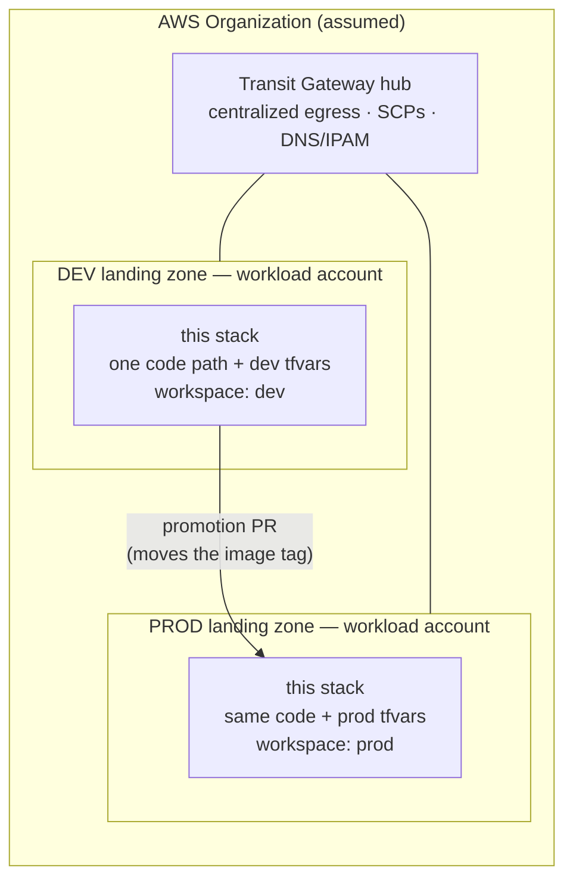
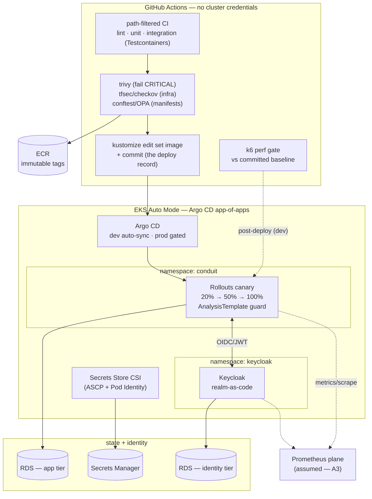

# Fig. 1 — Landing-zone context

Two workload landing zones under one (assumed) organization: shared
network hub, identical stack per zone, `terraform workspace` selects the
target, promotion is a PR between overlays.

# Fig. 2 — Platform architecture

CI builds, scans, and commits the deploy record; the cluster pulls; the
workload runs canaried with an AnalysisTemplate guard; per-tier RDS and
Secrets Manager serve state and credentials. The Prometheus plane is an
assumed external dependency ([assumption A3](../assumptions.md)).

# Regenerating

Sources are these Mermaid blocks. Render with any Mermaid-capable viewer
(GitHub renders them natively); if SVG exports are ever needed, export
from the rendered view — never commit a stale export.
